# SmartTONG AI 🗑️
## Multi-Agent AI Smart Waste Management & 3D Digital Twin Ecosystem

[](https://smarttong.vercel.app)
[](https://smarttong.vercel.app/simulator/)
[](https://smarttong.vercel.app/dashboard/)
[](https://smarttong.vercel.app/citizen-app/)
[](https://huggingface.co/spaces/ninjayy/smarttong-ai)
[](https://github.com/yapyap06/smarttong)

> **SmartTONG AI** is a state-of-the-art solar-powered smart waste management platform developed for municipal councils across Selangor (KDEBWM, MBSJ, MBPJ, MBSA, MPKS, MPAJ). The ecosystem bridges physical IoT waste bins, edge-AI image classification, real-time telemetry, a 3D digital twin simulator, and an optimized municipal collection fleet logistics engine.

---

## 📐 System Architecture & Multi-Agent AI Flow

```mermaid
flowchart TD
    subgraph Clients ["👥 User Interfaces & Digital Twin"]
        CitizenApp["📱 Citizen Web PWA<br/>(Juara Kebersihan & Cam Scanner)"]
        PbtDashboard["🏛️ PBT Ops Dashboard<br/>(Muji Green/White Interface)"]
        GovPortal["🏢 Council Command Portal<br/>(MBSJ / MBPJ / MBSA / MPKS / MPAJ)"]
        Sim3D["🎮 3D Digital Twin Simulator<br/>(Three.js Kiosk, Flap Actuation, X-Ray)"]
    end

    subgraph SyncBus ["⚡ Real-Time Synchronization Bus"]
        BC["🔄 BroadcastChannel API<br/>(0ms Cross-Tab Relay)"]
        LS["💾 Browser LocalStorage<br/>(State Persistence & Timers)"]
        HFRelay["☁️ HF Space REST Relay<br/>(/bin-status, /bin-reset, /actuate)"]
    end

    subgraph CloudInfra ["☁️ Cloud Hosting & Distribution"]
        Vercel["⚡ Vercel Edge CDN<br/>smarttong.vercel.app"]
        HFSpace["🤗 Hugging Face Spaces<br/>ninjayy-smarttong-ai.hf.space"]
        Render["🐍 Render Cloud Backend<br/>smarttong-backend.onrender.com"]
        Firebase["🔥 Firebase Cloud<br/>(Firestore, Storage, Functions)"]
    end

    subgraph AIPlatform ["🤖 Multi-Agent AI Engine"]
        KerasVision["📷 1. Fine-Tuned Keras Classifier<br/>(EfficientNetV2 224x224, 6 Waste Classes)"]
        ContamAgent["🧪 2. Contamination & Telemetry Agent<br/>(MQ-135 Gas PPM, Moisture, Anomaly)"]
        RouteAgent["🚛 3. Smart Logistics & Route Agent<br/>(5-Bin Circuit Loop, Slow Navigation)"]
        SilaTanya["💬 4. SilaTanya AI Assistant<br/>(Gemini 2.5 Flash + Selangor SOP RAG)"]
    end

    subgraph IoTLayer ["🔌 Smart Bin IoT Hardware"]
        ESP32["⚡ ESP32 Solar Retrofit Node"]
        Sensors["📡 4x HC-SR04, MQ-135, PIR, Solar Telemetry"]
        Actuators["🔒 4x Servo SG90 Flaps, SSD1306 OLED, Audio"]
    end

    CitizenApp -->|Host on| Vercel
    PbtDashboard -->|Host on| Vercel
    GovPortal -->|Host on| Vercel
    Sim3D -->|Host on| Vercel

    Sim3D <-->|Instant Local Sync| BC
    PbtDashboard <-->|Instant Local Sync| BC
    BC <-->|Persist| LS

    Sim3D <-->|HTTP Polling & Relay| HFRelay
    PbtDashboard <-->|HTTP Polling & Relay| HFRelay
    CitizenApp -->|Actuate Flap| HFRelay

    CitizenApp -->|Image Inference| KerasVision
    PbtDashboard -->|Image Inference| KerasVision
    HFSpace -->|Hosts Service| KerasVision
    HFSpace -->|Hosts Service| HFRelay

    CitizenApp -->|Chat Consultation| SilaTanya
    HFSpace -->|Gemini 2.5 Flash Relay| SilaTanya

    PbtDashboard -->|Calculates Circuit & ETA| RouteAgent
    Sensors -->|Sensor Readings| ContamAgent
    ContamAgent -->|Hazard Flag| PbtDashboard

    CitizenApp -->|Aduan & Points| Firebase
    GovPortal -->|Aduan Review & Logs| Firebase

    Sensors -->|Telemetry| ESP32
    ESP32 -->|Controls| Actuators
    ESP32 -.->|Mirrored by Digital Twin| Sim3D
```



---

## 🌟 Core Modules & Technical Innovations

### 1. 🎮 3D Digital Twin & Circuit Simulator (`/simulator/`)
- **Three.js WebGL Kiosk Model:** Fully interactive 3D representation matching real-world industrial kiosk blueprints.
- **Physical Compartment Simulation:** 4 segregated slots for **Plastik/Logam (Orange)**, **Kertas/Kadbod (Blue)**, **Kaca (Brown)**, and **Sisa Baki (Black)**.
- **Dynamic 10% Stack Physics:** Waste accumulation renders in realistic 10% discrete increments per deposit with calibrated material thickness (preventing overflow rendering).
- **Realistic Material Density Weight Calculation:**
  - *Plastik & Logam*: 0.12 kg per 1% fill (e.g. tin aluminium, botol PET)
  - *Kertas & Kadbod*: 0.18 kg per 1% fill (e.g. surat khabar, kotak beralun)
  - *Kaca*: 0.30 kg per 1% fill (e.g. botol kaca tebal, balang makanan)
  - *Sisa Baki (General)*: 0.22 kg per 1% fill (sisa basah, pembungkus)
- **Circuit Inspection (X-Ray Mode):** Reveals the internal schematic including the ESP32 microcontroller, 4x SG90 servo flap actuators, 4x HC-SR04 ultrasonic depth sensors, MQ-135 air quality sensor, and color-coded wire harnesses (VCC, GND, Signal).
- **Two-Row Centralized Control Toolbar:**
  - *Top Row*: Camera angles (`Pandangan Hadapan`, `Pandangan Atas`) and `Mod Litar & Mekanikal (X-Ray)`.
  - *Bottom Row*: Centralized `Uji Imbasan:` test actuation buttons for instant one-click hardware simulation.
- **Zero-Latency Cross-Tab Synchronization:** Interacts seamlessly with the PBT dashboard via HTML5 `BroadcastChannel` with fallback to `localStorage` and Hugging Face cloud endpoints.

### 2. 🏛️ PBT Operations & Logistics Dashboard (`/dashboard/`)
- **Muji-Inspired Clean Design:** Minimalist green & white aesthetic (`#15803d` / `#f8fafc`) featuring clean vector Lucide iconography and zero emojis for municipal command center presentation.
- **Executive KPI Cards:** Real-time visibility into **Tong Kritikal**, **Truk Sedia**, **Bahan API Jimat**, and **Kadar Kitar Semula**.
- **Dynamic Priority Alert Banner:** Automatically promotes Bin B01 to the top of the priority list when full (≥95%), displaying critical slots and live aggregate weight.
- **One-Click Remote Truck Dispatch:** 
  - Clicking **Dispatch Truk** triggers instantaneous cross-tab broadcast resetting the physical bin to 0% and 0.0 kg.
  - Clears digital twin 3D item stacks and logs the collection timestamp.
- **Connected Circuit Route Map:**
  - Standard OpenStreetMap tiles (watermark-free).
  - Continuous 5-bin collection loop:
    $$\text{B05 (Shah Alam)} \longrightarrow \text{B02 (SS15)} \longrightarrow \text{B01 (USJ 1)} \longrightarrow \text{B03 (Sunway)} \longrightarrow \text{B04 (Taman Jaya PJ)} \longrightarrow \text{B05}$$
  - Dual-layer vibrant emerald green line (`#16a34a`) with white casing and directional dashed accents.
  - **Very Slow Continuous Truck Movement:** The KDEB collection truck glides smoothly at an authentic, deliberate pace between collection points, dynamically rotating its bearing to align with the route heading, and pausing for 2.5 seconds at each bin to simulate waste emptying.

### 3. 📱 Citizen PWA (`Juara Kebersihan`, `/citizen-app/`)
- **Edge AI Camera Scanner:** Live camera capture or gallery file upload with automatic center-cropping to $224 \times 224$ pixels.
- **Direct Flap Actuation:** Instantly opens the corresponding digital twin flap when an item is scanned.
- **Aduan Rakyat & Geo-Tagging:** Citizens submit reports with photos and GPS coordinates, earning loyalty points (+10 pts upon review).
- **OKU Accessibility Suite:** Built-in Malay speech synthesis voiceover, high-contrast display mode, and responsive font scaling (80% to 140%).

### 4. 🤗 Hugging Face Space AI Backend (`ninjayy-smarttong-ai.hf.space`)
- **Pure FastAPI Server (No Gradio):** High-throughput, production-ready inference backend.
- **Fine-Tuned Keras EfficientNetV2 (`best_model_finetuned224.keras`):** 110 MB vision model trained across 6 waste classes: *Cardboard, Glass, Metal, Paper, Plastic, Trash*.
- **Independent Classification:** Core image analysis executes natively on the Keras neural network without relying on external vision APIs.
- **SilaTanya AI Chatbot:** Uses Gemini 2.5 Flash with official Selangor recycling SOP dataset for conversational citizen guidance (`POST /chat`).
- **RESTful Endpoints:**
  - `POST /predict`: Base64 image classification with bounding bin color, slot recommendation, and confidence score.
  - `POST /actuate`: Remote hardware/simulator flap actuation relay.
  - `GET /bin-status`: Real-time compartment fill percentages and aggregate weight.
  - `POST /bin-reset`: Truck dispatch reset signal.
  - `GET /health`: Model status and server health verification.

---

## 📁 Project Directory Structure

```
SmartTong/
├── vercel.json                 ← Vercel edge deployment routing
├── server.py                   ← Unified Python Flask server (Render)
├── app.py                      ← WSGI entry point
├── requirements.txt            ← Core Python dependencies
├── index.html                  ← Root landing page and portal router
├── simulator/
│   └── index.html              ← 3D Digital Twin Kiosk Simulator (Three.js WebGL)
├── dashboard/
│   └── index.html              ← PBT Operations Command Dashboard (Muji Theme)
├── citizen-app/
│   ├── index.html              ← Citizen PWA & Council Portal
│   ├── manifest.json           ← Progressive Web App manifest
│   └── sw.js                   ← Service worker offline cache
├── hf-space/                   ← Hugging Face Space Repository
│   ├── app.py                  ← FastAPI REST service (Keras + Gemini Chat)
│   ├── Dockerfile              ← Container configuration
│   ├── requirements.txt        ← TF/Keras, FastAPI, Uvicorn, Pillow
│   └── models/
│       └── best_model_finetuned224.keras ← 110 MB Fine-tuned EfficientNetV2
├── SmartTONG-AI/
│   ├── predict_server.py       ← Local standalone prediction server (Port 7862)
│   └── models/                 ← Local Keras models
├── firmware/
│   ├── SmartTong_main/         ← ESP32 Arduino hardware firmware
│   └── wokwi/                  ← Wokwi circuit simulation schematic
└── docs/                       ← Documentation, graphics, and system reports
```

---

## 🌐 Live URLs & Endpoints

| Environment | Endpoint / URL | Purpose |
| :--- | :--- | :--- |
| **Landing Portal** | [`https://smarttong.vercel.app`](https://smarttong.vercel.app) | Gateway to all ecosystem apps |
| **3D Digital Twin** | [`https://smarttong.vercel.app/simulator/`](https://smarttong.vercel.app/simulator/) | 3D Physical Kiosk & Circuit Simulator |
| **PBT Dashboard** | [`https://smarttong.vercel.app/dashboard/`](https://smarttong.vercel.app/dashboard/) | Municipal Fleet Dispatch & Route Map |
| **Citizen App** | [`https://smarttong.vercel.app/citizen-app/`](https://smarttong.vercel.app/citizen-app/) | Citizen PWA, Cam Scanner, Aduan |
| **HF Space API** | [`https://ninjayy-smarttong-ai.hf.space`](https://ninjayy-smarttong-ai.hf.space) | Live Cloud Keras Model & Actuation API |
| **Render Backend** | [`https://smarttong-backend.onrender.com`](https://smarttong-backend.onrender.com) | Python Cloud Server (Fallback) |
| **GitHub Repo** | [`yapyap06/smarttong`](https://github.com/yapyap06/smarttong) | Main Source Code Repository |

---

## ⚡ Quick Start & Local Development

### 1. Launch Web Apps Locally
Run any local static HTTP server from the project root:
```bash
# Python 3
python -m http.server 3000

# Or via Node.js
npx serve .
```
Then visit:
- Simulator: `http://localhost:3000/simulator/`
- PBT Dashboard: `http://localhost:3000/dashboard/`
- Citizen App: `http://localhost:3000/citizen-app/`

### 2. Run Local Python AI Inference Server (Optional)
To test image classification locally using the fine-tuned Keras model:
```bash
python SmartTONG-AI/predict_server.py
```
Server listens on `http://127.0.0.1:7862/predict`. Both the Dashboard and Citizen App automatically detect local execution and fall back to the live Hugging Face Space API when deployed.

---

## 📊 Operational & Environmental Impact

| Operational Metric | Quantified Value | Source & Methodology |
| :--- | :--- | :--- |
| **Logistics Route Optimization** | **31% distance reduction** (~21.3 km/route) | Multi-stop circuit loop dispatch vs. fixed scheduling |
| **Weekly Fuel Savings** | **RM 1,176** (per 100 bins) | 420 Liters diesel saved × RM 2.80/L |
| **Weekly Carbon Avoidance** | **1.1 tonnes CO₂e** | 2.68 kg CO₂ emitted per Liter diesel |
| **Contamination Prevention** | **>88% sort purity** | Automatic servo-locking flaps based on AI classification |
| **Retrofit Kit Unit BOM** | **~RM 180 / bin** | ESP32 + 4x Ultrasonic + MQ-135 + SG90 Servos |

---

*SmartTONG AI · Smart Waste Management & 3D Digital Twin Ecosystem for Selangor*

