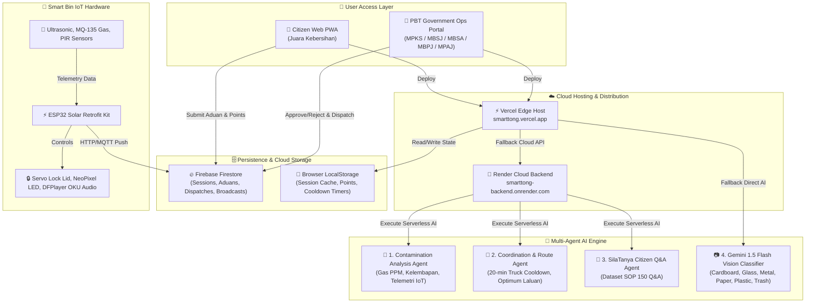

# SmartTONG AI 🗑️
## Multi-Agent AI Smart Waste Management System

[](https://smarttong.vercel.app)
[](https://smarttong-backend.onrender.com)
[](https://github.com/yapyap06/smarttong)

> **SmartTONG AI** is a solar-powered retrofit smart bin ecosystem and Multi-Agent AI platform designed for municipal councils (KDEBWM, MBSJ, MBPJ, MBSA, MPKS, MPAJ). It combines real-time IoT sensor telemetry, AI waste classification, automated truck dispatching with 20-minute cooldowns, citizen reporting, and OKU audio accessibility.

---

## 📐 System Architecture & Multi-Agent AI Flow



---

## ✨ Key Features & Enhancements

### 1. 🏢 PBT Government Command Center (`/citizen-app/index.html`)
- **Multi-Council Dynamic Branding:** Supports login by council department (e.g. `MPKS — Klang`, `MBSJ — Subang Jaya`, `MBSA — Shah Alam`, `MBPJ — Petaling Jaya`, `MPAJ — Ampang Jaya`, `KDEBWM`). Official broadcasts dynamically display the logged-in council badge.
- **Truck Dispatch with 20-Minute Cooldown:** 
  - Clicking **Dispatch Truk** on any bin switches the button to a **disabled gray state** (`#9CA3AF`).
  - Displays a live countdown timer (`Truk Dihantar (19m 59s)`).
  - Automatically resets to **GREEN** after 20 minutes. Cooldown state persists in `localStorage`.
- **Redesigned Aduan Management:**
  - Standardized square thumbnail image frame (72×72px header / 120×120px body).
  - Date & Time stamp on every card with newest-first sorting.
  - Quick action buttons (✓ Lulus / ✕ Batal) on both card header and expanded detail view.
  - Optional reviewer rejection reasons stored in Firebase.

### 2. 📱 Citizen PWA (`Juara Kebersihan`)
- **AI Cam Scanner:**
  - Dual capture modes: **Live Camera** or **Pilih Gambar (Photo Gallery Upload)**.
  - Automatic device camera selection (back camera for mobile phones, front camera for laptops).
  - Natural unmirrored viewport preview.
- **Real-Time Aduan Status & Points Sync:**
  - Citizens earn +10 points for submitted reports. Points decrease (-10) if rejected by PBT, and "Disahkan" count increments when approved (`Lulus`).
  - Full Aduan History with reviewer feedback cards.
- **Accessibility & Settings:**
  - Saiz Teks UI zoom scaling (80% to 140%).
  - High Contrast mode & MyDigital ID single sign-on demo.

### 3. 🤖 Multi-Agent AI Engine
- **Contamination Agent:** Reads IoT gas (PPM) & moisture sensor data to detect hazardous waste and potential gas leaks.
- **Coordination Agent:** Ranks bins by urgency score and calculates optimal truck dispatch routes and cost savings.
- **SilaTanya AI Assistant:** 150 Q&A SOP dataset + Gemini 1.5 Flash natural language chat.

---

## 📁 Project Structure

```
SmartTong/
├── vercel.json                 ← Vercel deployment & route configuration
├── server.py                   ← Unified Flask server for Render (predict + chat)
├── app.py                      ← Gunicorn WSGI entry point for Render
├── requirements.txt            ← Python dependencies (Flask, CORS, Pillow, NumPy, Gunicorn)
├── index.html                  ← Root redirect for Vercel static hosting
├── citizen-app/
│   ├── index.html              ← Main Web App (Citizen PWA + PBT Government Portal)
│   ├── manifest.json           ← PWA manifest
│   └── sw.js                   ← Service worker offline support
├── dashboard/
│   └── index.html              ← Dedicated PBT Analytics Dashboard
├── SmartTONG-AI/
│   ├── predict_server.py       ← Local Image Classification Server (Port 7862)
│   ├── app.py                  ← Gradio Waste Classifier UI
│   └── models/                 ← TensorFlow Keras EfficientNet models
├── backend/
│   ├── chat_agent.py           ← Local Chat Assistant Server (Port 7863)
│   └── functions/              ← Firebase Cloud Functions (TypeScript)
├── firmware/
│   ├── SmartTong_main/         ← Arduino Sketch for ESP32 hardware
│   └── wokwi/                  ← Wokwi circuit diagram & configuration
└── docs/                       ← Documentation & presentation assets
```

---

## 🌐 Live URLs & Deployment Architecture

| Environment | URL | Details |
| :--- | :--- | :--- |
| **Vercel Web App** | [`https://smarttong.vercel.app`](https://smarttong.vercel.app) | Public PWA Frontend (HTML/CSS/JS) |
| **Render AI Backend** | [`https://smarttong-backend.onrender.com`](https://smarttong-backend.onrender.com) | Live Cloud Python AI Server |
| **GitHub Repository** | [`yapyap06/smarttong`](https://github.com/yapyap06/smarttong) | Source Code Repository |

---

## ⚡ Local Setup Guide

### 1. Run Local Web App
Open `citizen-app/index.html` in any browser, or serve locally using Python:
```bash
python -m http.server 3000
```
Visit `http://localhost:3000/citizen-app/index.html`.

### 2. Run Local Python AI Servers (Optional)
To run the local TensorFlow model and Flask Chat Agent:

```bash
# Terminal 1: Cam Scanner Prediction Server (Port 7862)
python SmartTONG-AI/predict_server.py

# Terminal 2: Chat Assistant Server (Port 7863)
python backend/chat_agent.py
```

---

## 📊 Key Operational Metrics & Performance Impact

| Operational Metric | Estimated Value | Analysis & Calculation Source |
| :--- | :--- | :--- |
| **Municipal Daily Waste Coverage** | 39,900 tonnes | Public Sanitation Data |
| **SmartTONG Route Optimization** | ~31% (21.3 km reduction per route) | Nearest-neighbour AI logistics route simulation |
| **Weekly Fleet Fuel Savings** | RM 1,176 (per 100 bins) | Calculated: 420 L × RM 2.80/L |
| **Weekly CO₂ Reduction** | 1.1 tonnes CO₂ avoided | 2.68 kg CO₂ per L fuel saved |
| **Retrofit Sensor Kit BOM** | ~RM 180 / bin | ESP32 + Ultrasonic + MQ135 sensor kit estimate |

---

## 🛠️ Technical Specifications & System Compatibility

| System Component | Specification / Standard | Capabilities & Integration |
| :--- | :--- | :--- |
| **Frontend Web PWA** | HTML5 / CSS3 / ES6 Vanilla JS | Progressive Web App with offline caching & Vercel deployment |
| **AI Inference Engines** | TensorFlow Keras + Gemini 1.5 Flash Vision | Dual-engine image classification & natural language processing |
| **Cloud Backend API** | Python Gunicorn Flask Server | RESTful API endpoints hosted on Render for cloud AI processing |
| **Database & Realtime Sync** | Firebase Firestore | Real-time session management, dispatch tracking, & broadcast sync |
| **Hardware Retrofit Kit** | ESP32 Microcontroller | Solar-powered IoT telemetry (Ultrasonic, MQ-135 Gas, Servo, Audio) |

---

*SmartTONG AI · Multi-Agent AI Smart Waste Management System*
